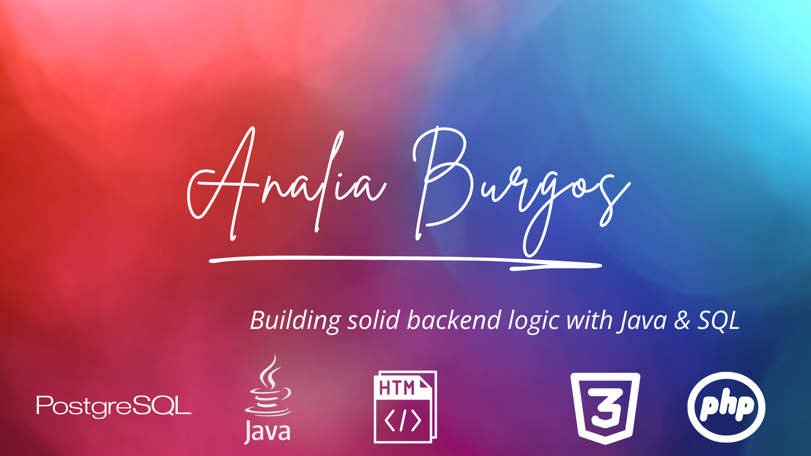

<!-- Banner o imagen personalizada (opcional) -->
<!-- Puedes crear una imagen en Canva y subirla al repo para colocar aquí -->

  

<h1 align="center" style="color:#2b1f51;">✨ ¡Hola! Soy Analía Burgos! ✨</h1>

Desarrolladora Back-End con enfoque en Java y bases de datos relacionales.  
Apasionada por construir aplicaciones eficientes, escalables y con código limpio.  

---

## 🚀 Tecnologías que manejo

   
  
  
   
  
   
   

---

## 📂 Proyectos destacados

### 🎬 **Videoteca App**
App CRUD para administrar una videoteca: películas, empleados, departamentos y distribuidores.  
🔧 Tecnologías: Java, Javalin, PostgreSQL, HTML/CSS  
📌 Incluye consultas SQL complejas, vistas, restricciones y documentación profesional.  
🔗 [Ver repositorio](https://github.com/tuusuario/nombre-repo) | 🌐 [Ver demo](https://tudemo.vercel.app)

---

### 🤝 **Voluntarios ONG - API REST con PostgREST**
API para consulta de datos de voluntarios utilizando PostgREST sobre base PostgreSQL.  
🔧 Tecnologías: PostgreSQL, SQL, PostgREST  
🔗 [Ver repositorio](https://github.com/tuusuario/nombre-repo)

---

### 🛴 **Sistema de alquiler de monopatines**
Arquitectura web con microservicios en Java/Spring Boot. Incluye GPS, cuentas, reportes y administración de precios.  
🔧 Tecnologías: Java, Spring Boot, REST, PostgreSQL  
🔗 [Ver repositorio](https://github.com/tuusuario/nombre-repo)

---

## 📊 GitHub Stats

  
  

---

## 📫 Contacto

- 💼 LinkedIn: [linkedin.com/in/tuperfil](https://linkedin.com/in/tuperfil)
- 📧 Email: [tuemail@gmail.com](mailto:tuemail@gmail.com)

---

Gracias por visitar mi perfil 🙌  

